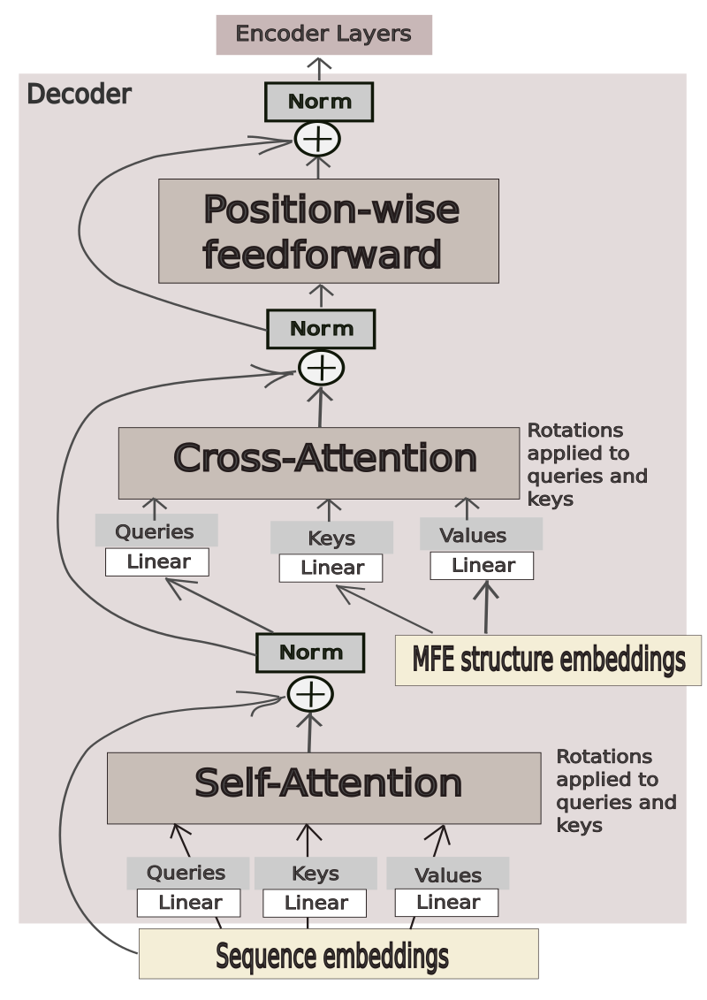

# 60th Place Solution for the Stanford Ribonanza RNA Folding Competition

## Context

* Competition overview: https://www.kaggle.com/competitions/stanford-ribonanza-rna-folding/overview

* Data: https://www.kaggle.com/competitions/stanford-ribonanza-rna-folding/data

## Summary 

The notebook published by Iafoss [1] was my starting point. 
I used transformer architecture in this competition. 
Here are the details of the generated submissions that 
might have contributed to the result:

* In addition to sequence itself, I used minimum free energy (MFE) 
RNA secondary structure 
in dot-parentheses notation. 
For some experiments, I also calculated base pair probability matrices 
(BPPs), 
however, the best-scoring submission did not use them. 
Both MFE and BPPs were obtained via EternaFold package [2].
* Position information is encoded via rotary embeddings [3] in the best-scoring 
submission. Some other experiments use both rotary and 
sinusoidal embeddings.
* Sequences and MFE indices always have end-of-sequence (EOS) token 
appended at the beginning and at the end.
* Sequences and MFE indices are padded from both sides so that 
the middles of all RNA molecules enter the model at roughly 
the same position.
* Each model makes two types of predictions: 

## Scores

The best model achieved 0.15867 MAE on private 
and 0.15565 MAE on public leaderboard. I will refer to this submission as 
"submission-27" for historical reasons.

"Submission-23" was the second submission I chose for evaluation, with 
0.17211 private and 0.15363 public MAE score.

The submission with the best public score was not chosen for evaluation 
because the model does not generalize well, as per "How to check if 
your model generalizes to long sequences" discussion.

## Models

### "Submission-27"

The model for "submission-27" consists of one decoder layer as the 
first layer
and eight BERT-like encoder layers on top. 

The decoder layer accepts 
sequence embeddings 
as "target" and MFE-structure embeddings as "memory"
(information that would be coming from an encoder in a 
traditional encoder-decoder transformer). A mask that prevents the 
decoder from attending to padding tokens is applied. Other than masking 
the padding tokens, no other mask is applied, and the decoder is able 
to attend to all information 
it receives. A schematic presentation of how the information flows through the decoder 
is given in Figure 1.

    Figure 1. The flow of information through the decoder layer for 
"submission-27".

Rotary embeddings are used in every attention module inside the model.

### "Submission-23"

The model for "submission-23" consists of two decoder layers 
accepting sequence embeddings together with additional information 
and 
eight BERT-like encoder layers on top. 

The first decoder layer
receives embedded sequences (sinusoidal embeddings are used from 
the starter notebook) and performs self-attention in the standard manner. 
After the addition and normalization, another attention-related
matrix multiplication is performed where BPPs are used as attention scores,
followed by the position-wise feedforward layer.

The second decoder layer is analogous to the decoder depicted in 
Figure 1. However, instead of sequence embeddings it receives the output 
from the first decoder layer. 

Thus, the first decoder layer uses BPPs and the second decoder layer uses 
MFE structure as additional information. More details on the architecture 
can be
found in the code.

## Training

The training procedure was adopted from the starter notebook. 

The training was performed for 45 epochs on 
"Quick_Start" data (after some processing) for both 
"submission-27" and "submission-23". 
Model were saved after each epoch. The last model was picked for 
"submission-23" and the model after 28 epochs for 
"submission-27". 

## Notes on the code

This repository is set up to reproduce two of my solutions: 
"submission-27" and "submission-23".

## Other approaches that were tried

## Acknowledgements

## References

